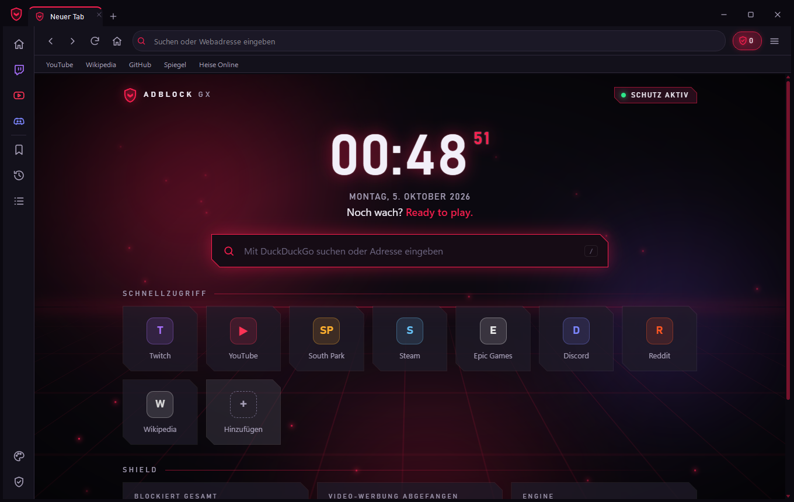
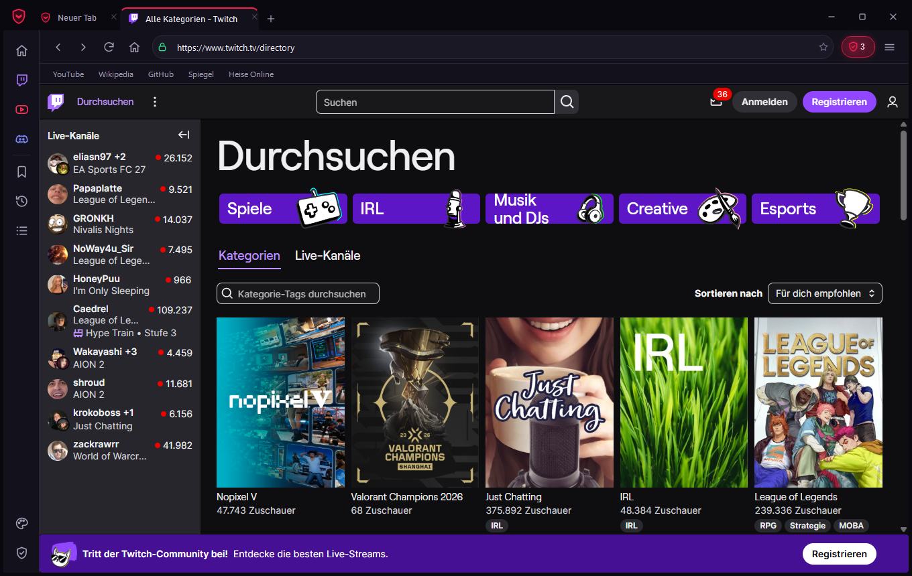
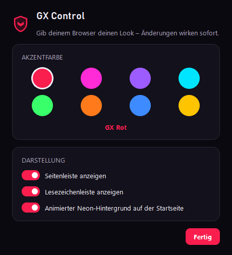
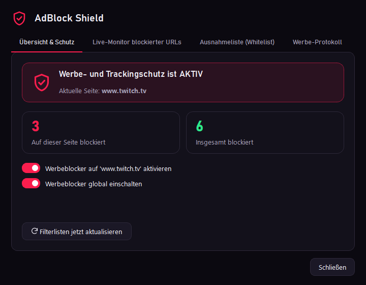

# 🛡️ AdBlock Browser GX (Claude-Variante)



Desktop-Browser für Windows: **PyQt6**-Oberfläche, **Microsoft Edge WebView2** als Web-Engine
(per pythonnet eingebettet) und die **Brave AdBlock Rust-Engine** (`adblock`) als Werbeblocker.

Diese Variante basiert auf `..\adblock-browser` und lässt das Original unverändert.
Sie hat ein **eigenes Profil** (`browser_data\`), Cookies/Verlauf werden nicht geteilt.

---

## 🌟 Funktionen

- **Netzwerk-Blocker** – jede Anfrage läuft durch die Brave-Engine mit
  EasyList, EasyPrivacy, EasyList Germany und Peter Lowe's Liste (~120.000 Regeln)
  plus den mitgelieferten **Seiten-Fixes** (`site_fixes.txt`).
- **South Park ohne Werbung** – auf southpark.de wird die Werbung von Google DAI
  serverseitig in den Videostream geschnitten. Der Browser blockiert die DAI-Stream-Anfrage,
  der Player fällt dann auf den Original-Stream ohne Werbung zurück
  (Details: Kommentare in `site_fixes.txt`).
- **Kosmetische Filterung** – die Seite meldet ihre CSS-Klassen/IDs an den Browser, der
  antwortet mit den passenden Ausblende-Regeln (seitenspezifisch **und** die generischen
  `##.klasse`-Regeln der Listen). Eingefügt als Constructable Stylesheet, funktioniert
  dadurch auch auf Seiten mit strenger Content-Security-Policy.
- **Popup-Blocker** – Fenster, die eine Seite ohne Klick öffnen will, werden verworfen.
  Links mit `target=_blank` öffnen weiter als neuer Tab.
- **Twitch ohne Video-Werbung** – Twitch schneidet Werbung in den Live-Stream
  (`scripts/twitch_*.js`). Der Browser hängt sich in den Video-Worker des Players:
  - Werbung nur in *deiner* Sitzung (z. B. beim Öffnen eines Kanals): derselbe Stream wird über
    einen anderen Player-Zugang ohne Werbung geholt (popout → frontpage → autoplay) und bleibt
    dann für den Kanal in Benutzung.
  - Werbepause des Streamers (gilt für alle Zugänge gleichzeitig, meist 30–60 s): der Player
    wird abgedeckt und stumm geschaltet, mit Hinweis „Twitch-Werbepause … seit 0:08“. Danach
    läuft der Stream automatisch weiter.
- **YouTube ohne Werbung** – die Werbe-Daten (`adPlacements`, `playerAds`, `adSlots`) werden
  aus den Player-Antworten entfernt, bevor der Player sie sieht (`scripts/youtube.js`).
  Werbeblöcke in Startseite/Sidebar und der „Werbeblocker“-Hinweis werden ausgeblendet.
- **Shield-Dashboard** (Klick auf `🛡️ 14`): Statistik, Ausnahmeliste pro Seite,
  globaler Schalter, Live-Monitor, Filterlisten-Update. Änderungen laden die Seite neu.
- **Video-Vollbild** – drückt man im Player auf Vollbild, verschwinden Tab-, Adress- und
  Lesezeichenleiste und das Fenster geht in den Vollbildmodus.
- Tabs, Startseite mit eigenen Schnellzugriffen (werden gespeichert), Lesezeichen, Verlauf,
  Suche auf der Seite, Zoom, Entwicklertools.

## 🎮 Design (GX)

Gamer-Look im Stil von Opera GX – dunkle Flächen, eine Neon-Akzentfarbe, Schrift Bahnschrift.

- **Eigene Titelleiste** mit den Tabs (rahmenloses Fenster): oben ziehen = verschieben (Aero Snap),
  Doppelklick = maximieren, an den Rändern ziehen = Größe ändern.
- **Tabs** mit Favicon, **Lautsprecher-Symbol** wenn ein Tab Ton abspielt (Klick = stumm),
  Mittelklick schließt, Rechtsklick: neu laden, duplizieren, stummschalten, andere schließen.
- **Seitenleiste:** Startseite, Twitch, YouTube, Discord (öffnet oder springt zum vorhandenen Tab),
  Lesezeichen, Verlauf, Werbe-Protokoll, GX Control, Shield.
- **GX Control** (Paletten-Symbol unten in der Seitenleiste): 8 Akzentfarben – GX Rot, Neon Pink,
  Ultra Violett, Cyber Cyan, Toxic Grün, Lava Orange, Eis Blau, Gold Rush – sowie Seitenleiste,
  Lesezeichenleiste und animierter Hintergrund an/aus. Wirkt sofort.
- **Startseite:** Neon-Nebel + Synthwave-Gitter in der Akzentfarbe, Uhr, Suche (`/`),
  Schnellzugriff-Kacheln (eigene hinzufügen/entfernen), Shield-Statistik inkl. abgefangener
  Video-Werbung pro Seite.

| Twitch | GX Control | Shield |
|---|---|---|
|  |  |  |

## 🚀 Starten

Doppelklick auf **`start_browser.bat`** oder:

```powershell
python main.py
python main.py https://www.southpark.de
```

Desktop-Verknüpfung „AdBlock Browser (Claude)“ anlegen: `python create_shortcut.py`

## ⌨️ Tastenkombinationen

Funktionieren auch, während die Webseite den Fokus hat.

| Taste | Aktion |
|---|---|
| `Strg + T` / `Strg + W` | Neuer Tab / Tab schließen |
| `Strg + Tab` / `Strg + Shift + Tab` | Nächster / vorheriger Tab |
| `Strg + L` / `Alt + D` | Adressleiste |
| `F5` / `Strg + R` / `Strg + F5` | Neu laden / ohne Cache neu laden |
| `Alt + ←` / `Alt + →` / `Alt + Pos1` | Zurück / Vor / Startseite |
| `Strg + D` / `Strg + B` / `Strg + H` | Lesezeichen / Lesezeichenleiste / Verlauf |
| `Strg + F` | Suchen auf der Seite |
| `F11` / `Esc` | Vollbild an/aus / Vollbild verlassen bzw. Laden abbrechen |
| `F12` | Entwicklertools |
| `Strg + +` / `Strg + -` / `Strg + 0` | Zoom |

Downloads laufen über den eingebauten WebView2-Downloaddialog.

## 📝 Werbe-Protokoll (wenn doch Werbung kommt)

Der Browser schreibt mit, was bei Video-Werbung passiert – zu sehen im Shield-Dialog unter
**„Werbe-Protokoll“** (rot = Problem, grün = Blocker hat gegriffen).

- **Automatisch:** Läuft auf YouTube, Twitch oder South Park trotz Blocker eine Werbung, legt der
  Browser einen Vorfall an.
- **Von Hand:** Menü ☰ → **„⚠️ Werbung auf dieser Seite melden“** (auch im Shield-Dialog) – für
  jede Seite, auf der dir Werbung auffällt.

Ein Vorfall liegt in `browser_data\logs\vorfaelle\<Zeit>_<Seite>_<Art>\`:

| Datei | Inhalt |
|---|---|
| `info.json` | was passiert ist, Zustand der Blocker-Skripte, Filterlisten-Stand, WebView2-Version |
| `anfragen.tsv` | die letzten ~500 Netzwerk-Anfragen des Tabs (erlaubt / BLOCK, Typ, URL) |
| `screenshot.png` | was der Tab in dem Moment gezeigt hat |
| `playlist.m3u8` | (Twitch) die Werbe-Playlist, wie Twitch sie geschickt hat |
| `seite.json` | (von Hand gemeldet) Video-Zustand und eingebettete Frames der Seite |

Die Übersicht steht in `browser_data\logs\werbung.log` (eine Zeile pro Ereignis). Es werden
höchstens 50 Vorfälle aufgehoben. Alles bleibt lokal auf dem Rechner.

## 🧩 Eigene Filterregeln

Optional `browser_data\filters\user_rules.txt` anlegen (normale Adblock-Syntax, z. B.
`||werbung.example^` oder `@@||wird-faelschlich-geblockt.example^`). Wird beim Start und nach
jedem Filterlisten-Update mitgeladen.

## 🔧 Debug / Tests (Umgebungsvariablen)

| Variable | Wirkung |
|---|---|
| `ADBLOCK_REMOTE_DEBUG_PORT=9333` | Chrome-DevTools-Protokoll auf diesem Port (Steuerung/Inspektion von außen) |
| `ADBLOCK_REQUEST_LOG=pfad.log` | jede Anfrage mit `allow`/`BLOCK` und Typ protokollieren |
| `ADBLOCK_HIDDEN_WINDOW=1` | Testmodus: Fenster außerhalb des Bildschirms, ohne Fokus, stumm |
| `ADBLOCK_DATA_DIR=ordner` | anderes Profil/Daten-Verzeichnis (z. B. für Tests neben dem normalen Browser) |

## 📁 Projektstruktur

```
adblock-browser-claude/
├── main.py               # Einstiegspunkt
├── main_window.py        # Hauptfenster (rahmenlos), Tabs, Navigation, Vollbild, Tastenkürzel
├── gx_widgets.py         # Titelleiste mit Tabs, Fensterknöpfe, Seitenleiste
├── theme.py              # GX-Farben, Akzentfarben, Stylesheet, Design-Einstellungen
├── icons.py              # Linien-Icons (SVG) in beliebiger Farbe
├── design_dialog.py      # GX Control (Akzentfarbe, Seitenleiste, Animation)
├── browser_tab.py        # Tab mit WebView2: Blocker, kosmetische Filter, Popups, Startseite
├── filter_engine.py      # Brave-Engine, Filterlisten, Ausnahmeliste, Anfrage-Typen
├── site_fixes.txt        # Seiten-Fixes (u. a. South Park) in Adblock-Syntax
├── cosmetic_filter.py    # Seiten-Skript für kosmetische Filter (Klassen/IDs melden, CSS)
├── site_scripts.py       # lädt scripts/*.js und setzt Schutz-Einstellungen ein
├── ad_logger.py          # Werbe-Protokoll und Vorfälle
├── scripts/
│   ├── twitch_main.js    # Twitch: hängt sich in den Video-Worker des Players
│   ├── twitch_worker.js  # Twitch: Werbe-Playlists erkennen, werbefreien Stream einsetzen
│   ├── youtube.js        # YouTube: Werbe-Daten entfernen, Fallback, Werbeblöcke ausblenden
│   └── ad_watch.js       # erkennt durchgerutschte Werbung und meldet sie ans Protokoll
├── start_page.py         # GX-Startseite (virtueller Host start.adblockbrowser.example)
├── bookmarks_history.py  # Lesezeichen & Verlauf (JSON)
├── adblock_dialog.py     # Shield-Dashboard
├── history_dialog.py     # Verlaufsdialog
├── create_shortcut.py    # Desktop-Verknüpfung
├── assets/screenshots/   # Vorschaubilder für diese README
└── browser_data/         # Profil, Filterlisten, Einstellungen, ui_settings.json (automatisch angelegt)
```

## ⚠️ Grenzen

- Die South-Park-Lösung hängt davon ab, dass Paramount den Rückfall auf den werbefreien
  Stream beibehält. Ändern sie den Player, kann wieder Werbung kommen oder das Video
  schwarz bleiben – dann `site_fixes.txt` anpassen (Request-Log hilft beim Finden).
- **YouTube** lässt sich die Werbezeit serverseitig „bezahlen“: Bei manchen Videos schickt
  der Server die Videodaten erst nach ungefähr der Länge der Werbung. Statt Werbung sieht man
  dann einige Sekunden Ladekreis (gemessen 0–21 s; ohne Blocker liefen 12–23 s Werbung).
  Das lässt sich vom Browser aus nicht zuverlässig umgehen.
- **Twitch:** Während einer Werbepause des Streamers bekommt jeder Player-Zugang Werbung – es gibt
  dann keine werbefreie Quelle. Der Browser blendet sie aus, die Wartezeit bleibt aber (gemessen
  35–45 s). Twitch ändert seinen Player regelmäßig; wenn wieder etwas nicht stimmt: Werbe-Protokoll
  ansehen oder F12 → Konsole → `window.__abTwitch` (`adBreaks`, `replaced`, `masked`,
  `backupTrail`, `errors`). Die Ersatz-Zugänge stehen in `site_scripts.py` (`TWITCH_BACKUP_TYPES`).
- Scriptlets (`##+js(...)`) aus den Listen werden nicht ausgeführt.
